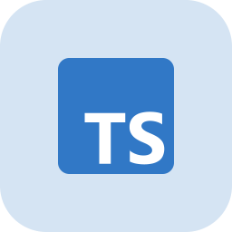
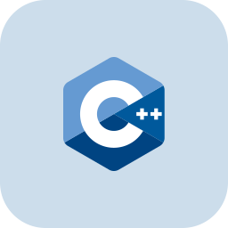
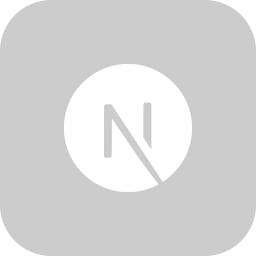
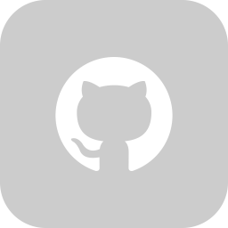

  

<h1 align="center">Hi 👋, I'm Aditya</h1>
<h3 align="center">A Freelancer For Extensive Nodejs/Nextjs Projects</h3>

- 🔭 I’m currently working on **[UniCon](https://github.com/Ethics03/UniCon) - Startup** + **personal projects**

- 📚 I’m currently learning **Full Stack Web Development** + **DevOps**

- 💬 Ask me about **Programming & Problem Solving Tasks**  

## 🐱‍👤 Languages and Tools:

  <a href="https://developer.mozilla.org/en-US/docs/Web/HTML" target="_blank">
  <a href="https://developer.mozilla.org/en-US/docs/Web/CSS" target="_blank">
  <a href="https://developer.mozilla.org/en-US/docs/Web/JavaScript" target="_blank">
  <a href="https://www.typescriptlang.org/" target="_blank">
  <a href="https://isocpp.org/" target="_blank">
  <a href="https://nodejs.org/" target="_blank">
  <a href="https://react.dev/" target="_blank">
  <a href="https://nextjs.org/" target="_blank">
    
  <a href="https://www.mongodb.com/" target="_blank"> 
  <a href="https://www.python.org/" target="_blank">
  <a href="https://git-scm.com/" target="_blank"> 
  <a href="https://github.com/" target="_blank"> 

 
 

## 🐱‍👓 Github Stats:

  

&nbsp;
    

    

## 🐱‍💻 Connect with me:

 

